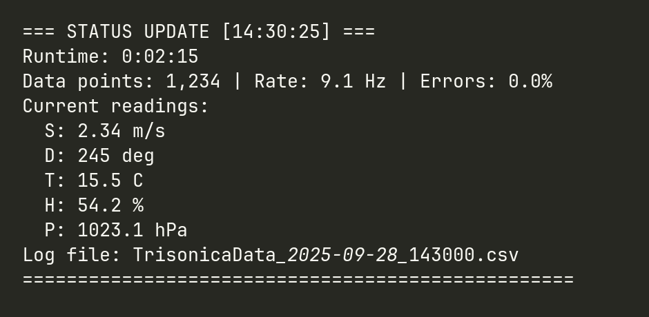
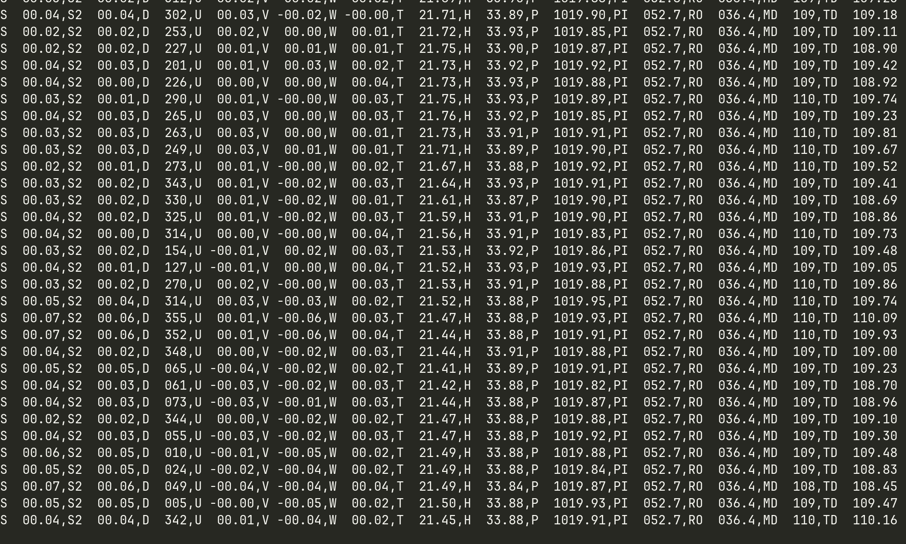
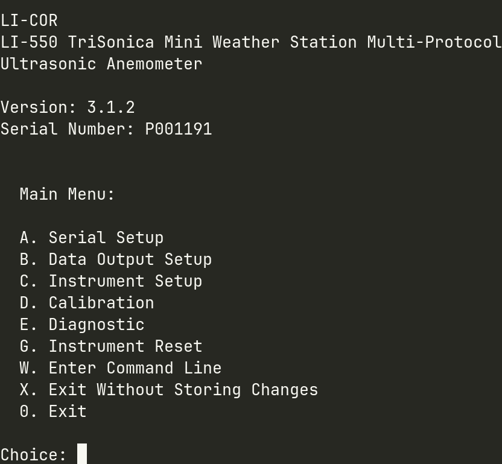

# Trisonica Li-550P Mini Datalogger RaspberryPi

## Overview
Data logging system for Trisonica Li-550P Mini anemometer on Raspberry Pi 3 Model B+.

**Manual**: [LI-COR Li-550P Documentation](https://www.licor.com/support/LI-550/manuals.html)



**Operates offline** - Everything included in this folder! Can also connect to internet for automatic UTC time synchronization when available.

## What's Included
- **Python data logger** with real-time CSV output
- **All dependencies** (pyserial only - lightweight!)
- **Enhanced console interface** with periodic status updates and LED indicators
- **Automatic UTC time sync** when internet available
- **Automatic device detection** and reconnection
- **Dual storage support**: External SD/USB + local backup
- **Raspberry Pi LED indicators** show system status and logging activity
- **Operates offline or online** - fully portable with optional internet connectivity

---

## Quick Start

### 1. Installation
```bash
# Copy this folder to your Pi (USB stick, etc.)
# Place in: Desktop/Trisonica/ (or anywhere)

cd Desktop/Trisonica/

# Fix permissions (if copied from USB/Windows)
bash fix_permissions.sh

# Install system
./install.sh
```

### 2. Time Setup (Automatic + Manual Options)
```bash
# OPTION A: Automatic UTC Sync (Recommended)
# Connect Pi to WiFi/Ethernet, then run:
./start_logger.sh
# System will auto-detect internet and sync UTC time

# OPTION B: Manual UTC Setting (if no internet)
sudo timedatectl set-timezone UTC
sudo date -s "2025-09-28 14:30:00"  # Use current UTC time

# Verify time
date -u  # Should show accurate UTC time
```

### 3. Connect Hardware
- **HDMI display** (if using): Connect HDMI cable **before** powering on the Raspberry Pi for best compatibility
- **Trisonica Li-550P Mini** -> USB -> **Pi USB port**
- **External SD/USB card** -> USB adapter -> **Pi USB port** (optional, for data storage)

### 4. Anemometer Placement (Critical for Data Quality)
**IMPORTANT**: Proper placement is essential for accurate readings
- **Minimum clearance**: 3-5 meters from obstacles in all directions
- **Avoid**: Buildings, trees, walls, vehicles, or other obstructions
- **Ultrasonic sensors** are highly sensitive to reflections and turbulence
- **Poor placement** is the primary cause of corrupted/error readings
- **Ideal setup**: Open field with unobstructed airflow

### 5. Start Logging
```bash
# Auto-syncs UTC time if internet available, then starts logging
./start_logger.sh
```

### 6. Stop Logging
- Press **Ctrl+C**
- Data automatically saved

---

## Console Interface

### Enhanced Terminal Logger (`datalogger_simple.py`)
- **Clean text interface** with periodic status updates
- **LED status indicators** using Raspberry Pi built-in LEDs:
  - **Activity LED (green)**: Blinks when actively logging data
  - **Brief flashes**: Indicate data writes to storage
  - **LED off**: System idle or stopped
- **Live data readings** every 0.5 seconds (2Hz) showing:
  - Current wind speed, direction, temperature
  - Data collection rate and error statistics
  - Runtime and log file information
- **Low resource usage** - perfect for headless operation
- **Comprehensive error handling** and device reconnection

---
## Configure the Trisonica
```bash
screen /dev/ttyUSB0 115200
```
Make sure to use the actual port name the trisonica is connected to.


Gives you the raw datastream once the anemometer connected and running. 


Pressing ESC will quit the datastream and opens the trisonica configuration settings.


## Data Storage

### Automatic Storage Selection
1. **External USB/SD card**: `/mnt/data_sd/` (preferred)
2. **Local Pi storage**: `./data/` (fallback)

### File Formats
```
TrisonicaData_2025-09-28_143000.csv     # Main data with timestamps
TrisonicaStats_2025-09-28_143000.csv    # Statistical summaries
```

### Data Parameters
| Code | Description | Unit | Range |
|------|-------------|------|-------|
| S    | Wind speed  | m/s  | 0-50  |
| S2   | Alt wind speed | m/s | 0-50  |
| D    | Wind direction | deg | 0-360 |
| T    | Temperature | °C | -40 to +60 |
| H    | Humidity | % | 0-100 |
| P    | Pressure | hPa | 900-1100 |

---

## Control Scripts

### Main Operations
- **`start_logger.sh`** - Auto-sync UTC time + start console logger
- **`test_connection.sh`** - Test device connection (30 sec)
- **`check_status.sh`** - Check system status

### Utilities
- **`install.sh`** - Main installer
- **`fix_permissions.sh`** - Fix file permissions after copy

---

## Troubleshooting

### No Device Found
```bash
# Check for USB serial devices
ls /dev/ttyUSB* /dev/ttyACM*

# If nothing found:
# 1. Check USB connection
# 2. Try different USB port
# 3. Check if device powers on
```

### Storage Issues
```bash
# Check storage status
./check_status.sh

# Manual external storage mount
sudo mkdir -p /mnt/data_sd
sudo mount /dev/sda1 /mnt/data_sd  # Adjust device as needed
```

### Time Issues
```bash
# Check current time
date -u
timedatectl status

# Auto-sync if internet available
./start_logger.sh  # Will auto-sync UTC before starting

# Manual time setting (if no internet)
sudo date -s "YYYY-MM-DD HH:MM:SS"
```

### Permission Problems
```bash
# Fix all script permissions
bash fix_permissions.sh

# Or manually
chmod +x *.sh *.py
```

---

## Technical Details

### System Requirements
- **Raspberry Pi 3 Model B+** (ARMv7)
- **Python 3.7+** (included with Raspberry Pi OS - COMPATIBLE!)
- **USB port** for Trisonica Li-550P Mini connection
- **Optional**: External USB storage for data

### Dependencies Included
- **pyserial 3.5** - Serial communication only
- **Standard library** - datetime, collections, signal, etc.
- **Ultra-lightweight** - minimal dependencies for maximum compatibility

### Data Quality Features
- **Error detection** for sensor malfunctions and invalid readings
- **Temperature validation** (negative values flagged as errors)
- **Connection monitoring** with automatic reconnection
- **Data validation** with quality flags
- **Statistical analysis** with error rates

### Common Error Sources
- **Poor anemometer placement** (primary cause - needs 3-5m clearance)
- **Ultrasonic path interference** from nearby obstacles
- **Loose wire connections** (secure all connections)
- **Sensor malfunctions** (flagged as -99.x values)
- **Data quality target**: Error rate should be < 5% for reliable measurements

### Storage Management
- **Automatic CSV headers** based on detected parameters
- **File rotation** for large datasets
- **Dual storage** with automatic fallback
- **Timestamp validation**

---

## File Structure

```
Trisonica_Portable/
├── README.md                   # This file
├── QUICK_START.txt            # Basic instructions
├── install.sh                 # Main installer
├── fix_permissions.sh         # Permission fixer
├── datalogger_simple.py       # Simple console logger
├── datalogger_simple.py       # Console logger with LED indicators
├── python_packages/           # Dependencies
│   ├── pyserial-3.5-*.whl   # Serial communication
│   ├── [minimal dependencies]  # Lightweight packages only
│   └── [other dependencies]
└── [Generated after install:]
    ├── start_logger.sh        # Start simple logger
    ├── start_logger.sh        # Start console logger
    ├── test_connection.sh     # Connection test
    ├── check_status.sh        # Status checker
    ├── data/                  # Local data storage
    └── [log files]
```

---

## Support

### Common Issues
1. **"Permission denied"** - Run `bash fix_permissions.sh`
2. **"No device found"** - Check USB connection, try `./test_connection.sh`
3. **"Wrong time in data"** - Connect to WiFi/ethernet and run `./start_logger.sh` for auto-sync
4. **"Storage full"** - Use external SD card or clean `./data/` folder

### Data Analysis
- **CSV format** - Import into Excel, Python pandas, R, MATLAB
- **Timestamp format** - ISO 8601 (YYYY-MM-DDTHH:MM:SS)
- **Missing values** - Empty cells for sensor errors
- **Quality flags** - Check statistics file for error rates

